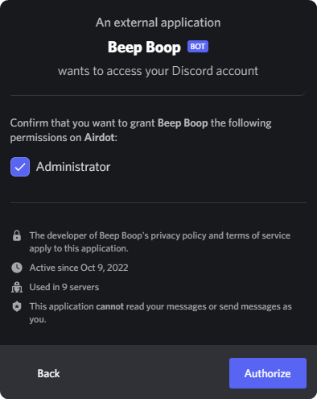

# Introduction

Welcome to Beep Boop's documentation! If you're new to Beep Boop, we reccomend that you continue reading our guide.

## Getting Started
First off, if you haven't already done this, [invite Beep Boop](https://bop.trtle.xyz/add). Select your server from the drop-down menu and click continue and authorize!

::: tip
You aren't sharing any sensitive information with us, you're only adding the bot to a server.
:::

## Configuring your server
You're now ready to [configure your server!](/server/basics)
