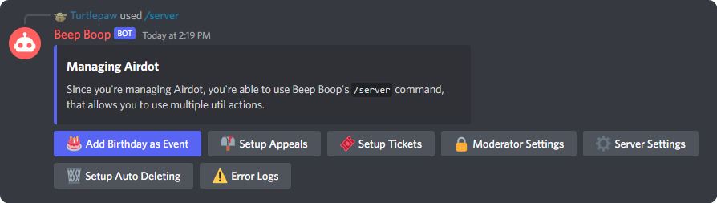

# The Basics

## Configuring your server
After you finished [inviting the bot](/#getting-started), you're now ready to start configuring your server! Go ahead and run `/server`, you should see a message with some buttons attached, as seen below.

Each one of these buttons configures a diffrent part of Beep Boop, for example `Setup Tickets` will start the setup process for tickets, a great way to let members contact your moderators privately.

We've dedicated each feature their own page, jump to a page below:

- [Add Birthday as Event](/server/server-birthday)
- [Tickets](/server/tickets)
- [Appeals](/server/appeals)
- [Moderator and Server Settings](/server/moderator-and-server-settings)
- [Auto Deleting](/server/auto-deleting)
- [Error Logs](/server/error-logs)