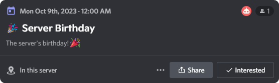

# Server Birthday

Celebrate your server's birthday by addding an event to Discord to show when your server's turning another number!

## Setting up
Create a server birthday event by going to [`/server`](/server/basics), and clicking `Add Birthday as Event`. This will add the server's birthday as an Discord event and will appear in the `Events` section of your server.

